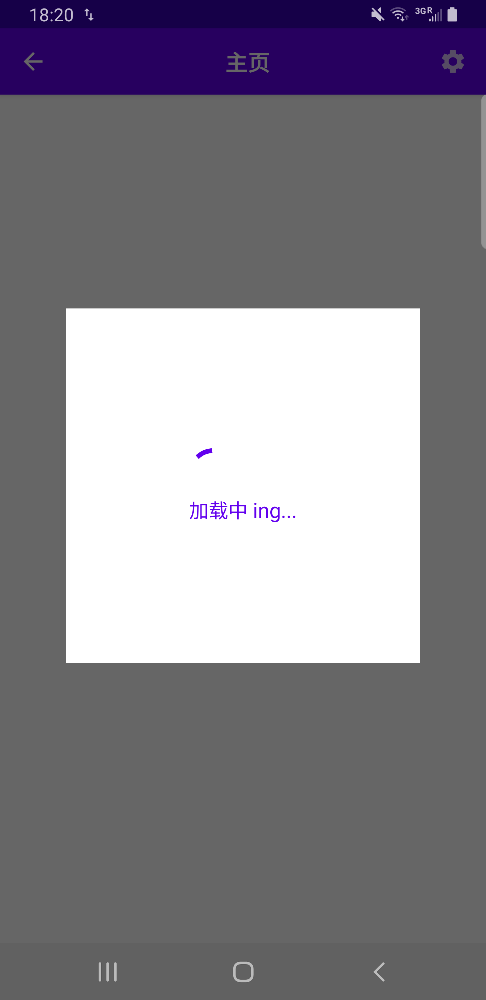
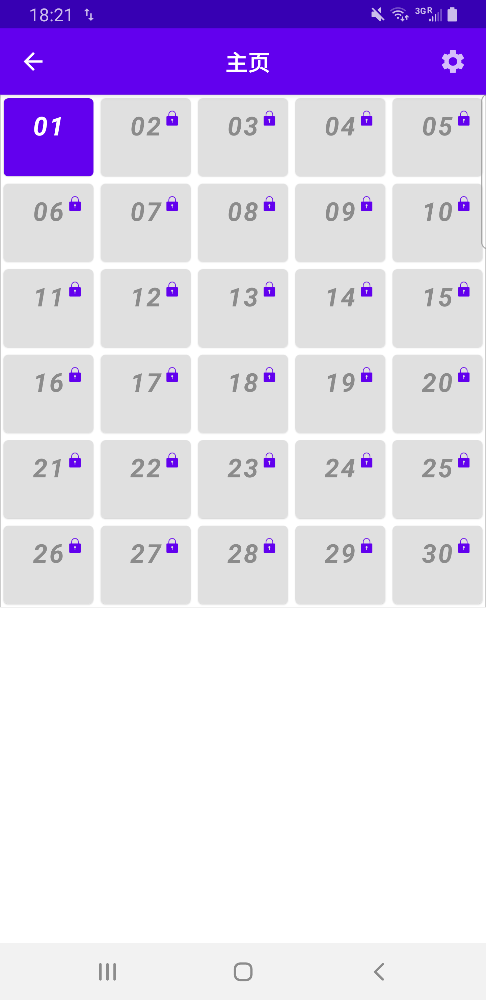
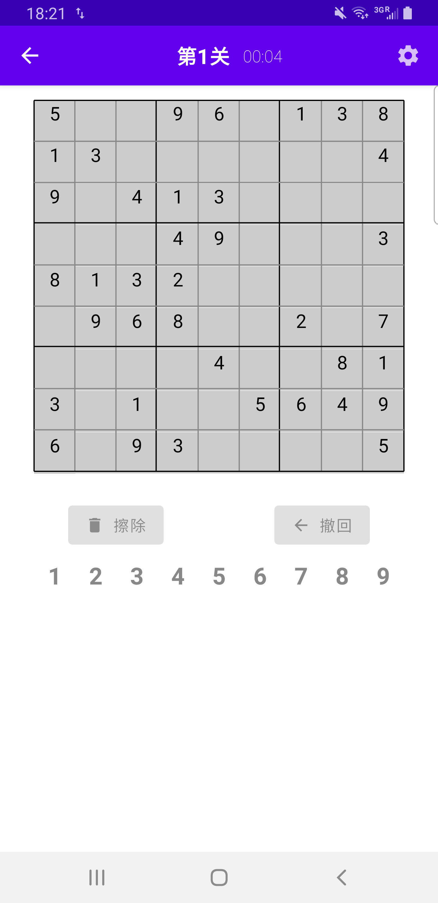
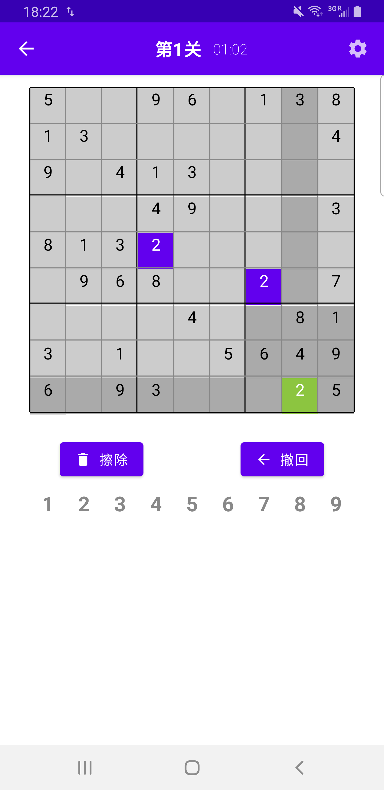
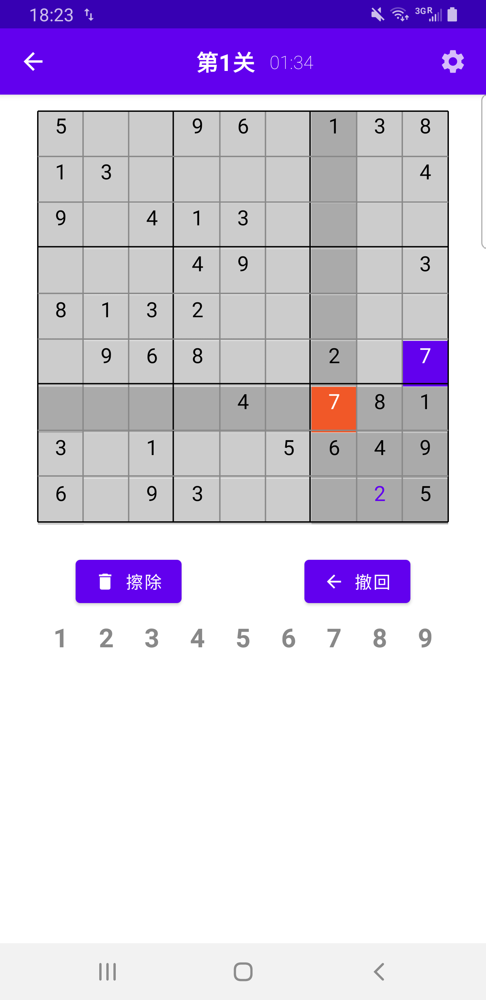

# ComposeApplication
## 简介
通过`Jetpack Compose`实现数独游戏,项目使用了`MVI`架构，实现基本功能，效果如下：

[玩法介绍](https://baikevideo.cdn.bcebos.com/media/mda-XBeU0kPaBN7yOxVq/169f7ffc2dafedf1bf00cb63ffefb1ec.mp4)
## `TODO`
* 通过导航将主要页面分离，将关卡页面与游戏页面进行分离
* 增加设置页面，并实现主要功能
  * 游戏暂停 （关闭计时器）
  * 音效开关 （实现音效并增加开关）
  * 震动开关 （实现震动并增加开关）
  * 玩法介绍（链接网页）
  * 切换不同主题（实现换肤功能）
